# About me

## Daniel Molina Cabrera

::: columns

:::: {.column width="50%"}

{width="50%"}

::::

:::: {.column width="50%"}
- Senior lecturer at University of Granada. 
- More than  15 years Working on AI.
- Courses: Machine Learning and Preprocessing.
- H-Index: 23
:::: 
:::

# Python

## Python?

{width="45%"}

## Python?

{width="45%"}

## Python?

{width="45%"}

---

## It is a programming language


- For generic usage.

. . . 

- Designed to be **easy to use** and **fun**.

---

## Invented by


# Why Python?

## It is popular

{width="70%"}

## Many libraries in DS

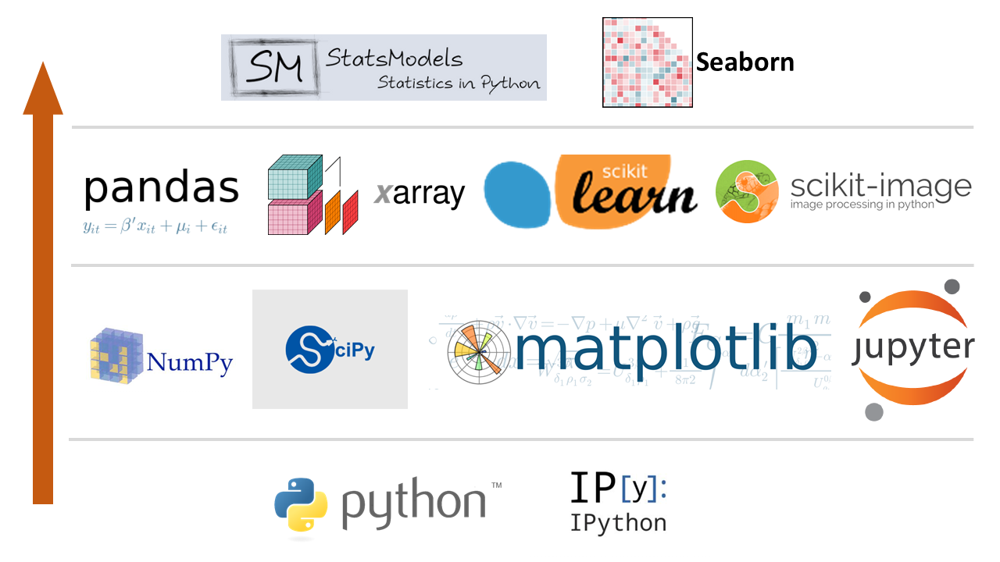{width="70%"}

## Specially in Machine Learning

{width="70%"}

## And Deep Learning

{width="70%"}

## Easy

```
from sys import argv

def main(fname, word):
    with open(fname, "r") as file:

        for line in file:
            if word in line:
                print(line)

if __name__ == "__main__":
    main(argv[2], argv[1])

```

# Requirement

## Requirement

::: columns

:::: {.column width="32%"}
{with="80%"}
::::
:::: {.column width="32%"}
{with="80%"}
::::
:::: {.column width="32%"}
{with="80%"}
::::
:::

## Requirement

- Computer.

- Any Operative System: Windows, MacOS, Linux.

- We will use Python3 using Anaconda.

{width="25%"}

## Installation

From
[https://docs.anaconda.com/anaconda/install/](https://docs.anaconda.com/anaconda/install/)

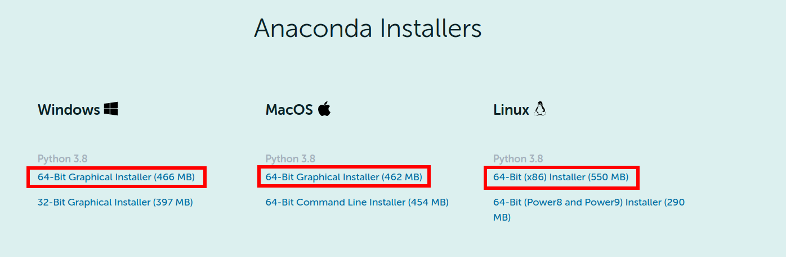

## windows

## Install 
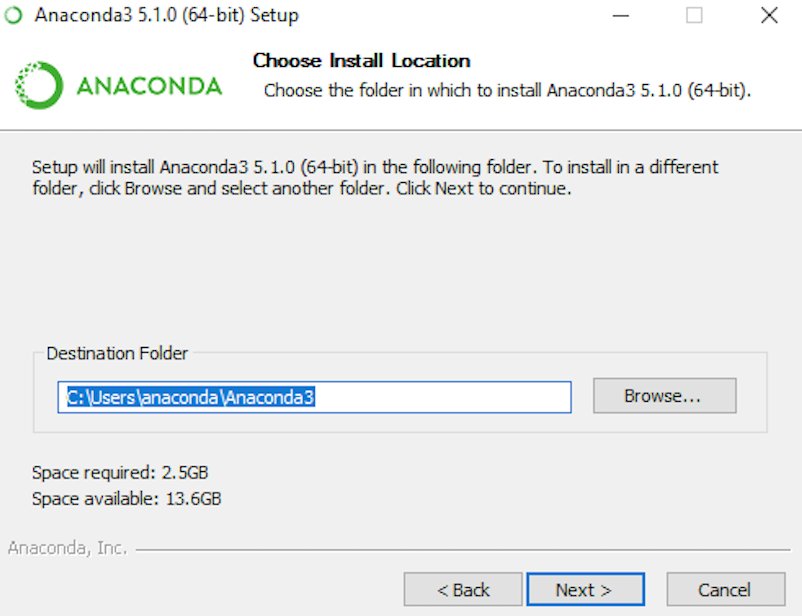{width="70%"}
    
## Install
{width="70%"}

## Install
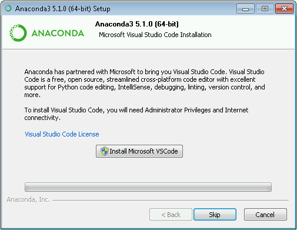{width="70%"}
 
## Install
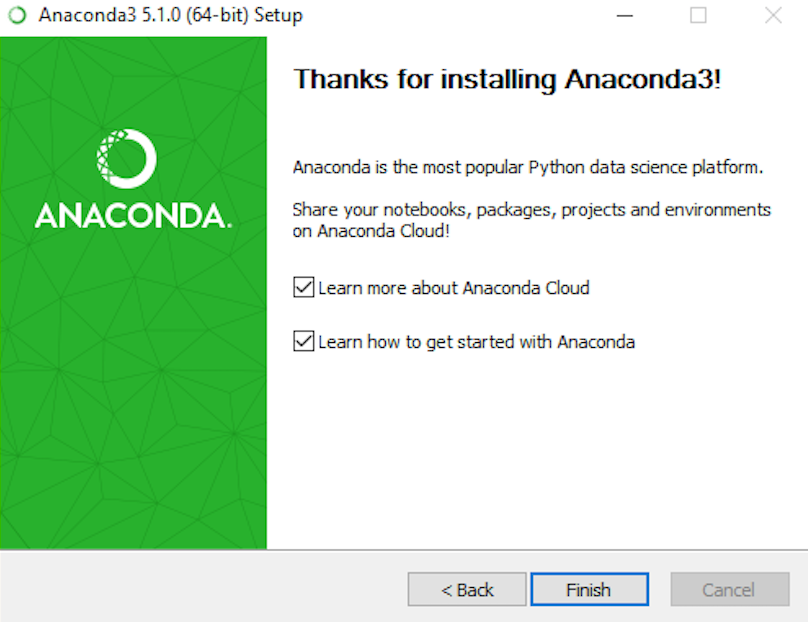{width="70%"}

## MacOs

## Install 
{width="70%"}
    
## Install
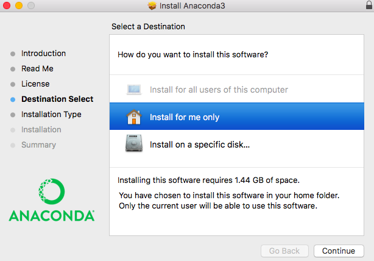{width="70%"}

## Install
{width="70%"}
 
## Install
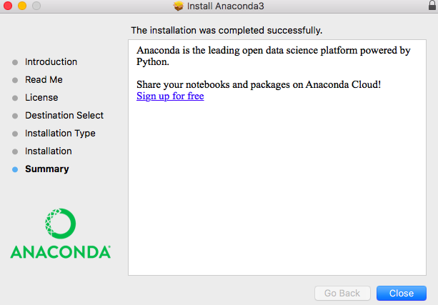{width="70%"}

## Linux

Using Anaconda

```
bash ~/Downloads/Anaconda3-5.1.0-Linux-x86_64.sh
```

# Frameworks

## Notebook

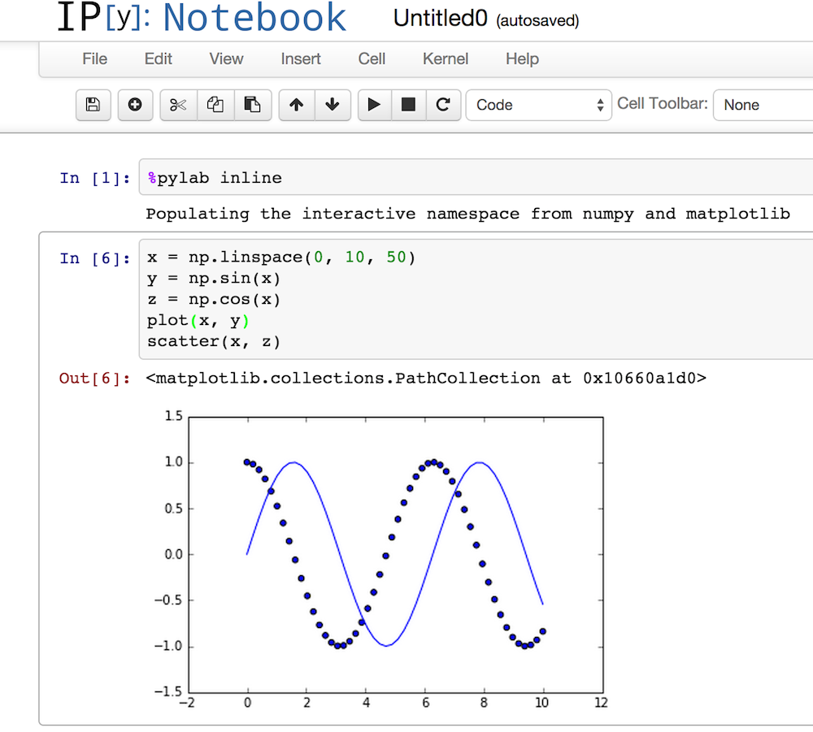{width="70%"}

---

## Advantages

- Code in cells. 

- Interactive. 

- Documentation, cells in markdown.

---


---

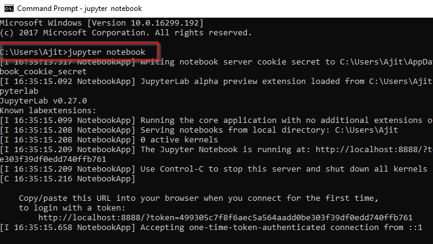

## Colab 

[https://colab.research.google.com/](https://colab.research.google.com/)

- Service for programming in Python. 

- Use for CPU or GPU (paying after several hours).

- It requires Google account.

## Colab

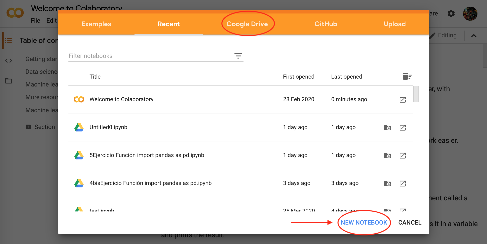{width="90%"}

## Spyder


## IPython Console

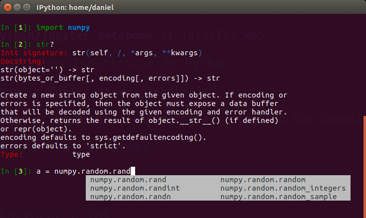{width="70%"}

## Python Console

{width="70%"}

# About the course

## First day (Monday)

- We will focus on supervised learning with Python. 

- Learning by project.

- Available Notebooks.

--- 

### Parts

1. About Python in Data Science. 

2. Pandas, simple preprocessing.

3. Scikit-learn with simple dataset.

4. Several useful models.

5. Visualization.

## Second day 

- We will focus on unsupervised learning with Python.

- Extracting information:
    1. Automatic grouping. 
    2. Rules Generation.
    
---

### Parts

1. Example Dataset.

2. Grouping groups of datasets.

3. Automatic Grouping.

2. Visualization of centroids. 

3. Automatic rules generation.

# Questions?

## We will start?

{width="50%"}
